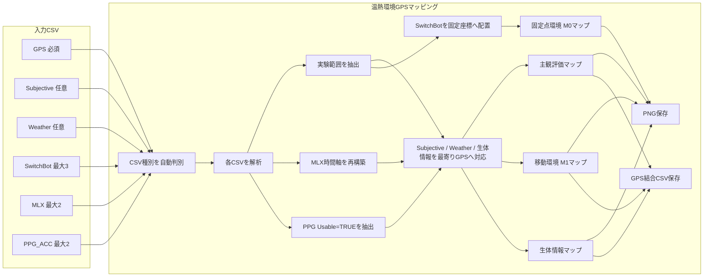

<div id="top"></div>

# 温熱環境GPSマッピング

温熱環境GPSマッピングは，屋外歩行実験で取得した GPS，主観評価，Kestrel 5500 の移動型気象情報，SwitchBot 温湿度計プラスの固定点環境情報，耳装着型デバイスの生体情報を統合し，地図上へ可視化する Web アプリケーションである．

GPS CSV を必須入力とし，Subjective CSV，Weather CSV，SwitchBot CSV，MLX CSV，PPG_ACC CSV を任意で読み込む．主観評価では温冷感，温熱的快・不快，温熱選好を表示する．環境評価では，Kestrel 5500 を用いた移動環境 M1 と，SwitchBot 温湿度計プラスを用いた固定点環境 M0 を切り替えて表示する．生体情報では，MLX の鼓膜方向温度 `Object_C` と，使用可能と判定した耳 PPG の心拍数 `Ear_HR_BPM_Window` を表示する．

Subjective，Weather，MLX，PPG_ACC は各データ時刻に最も近い GPS 点へ対応付ける．SwitchBot は既知の固定座標へ配置し，GPS との位置対応付けや固定点間の空間補間は行わない．Subjective CSV が存在する場合は，`START` 評価の Submit 時刻から `RECOVERY_END` 評価の Submit 時刻までを実験範囲とし，GPS，Weather，SwitchBot，MLX，PPG_ACC を同じ時間範囲へ制限して可視化する．

---

## 使用技術一覧

<p style="display: inline">
  
  
  
  
  
  
  
  
</p>

---

## 目次

- [プロジェクトについて](#プロジェクトについて)
- [ファイル構成](#ファイル構成)
- [利用ライブラリ](#利用ライブラリ)
- [入力ファイル](#入力ファイル)
- [CSVの自動判別](#csvの自動判別)
- [解析範囲](#解析範囲)
- [GPSとの対応付け](#gpsとの対応付け)
- [主観評価](#主観評価)
- [環境評価](#環境評価)
- [移動環境M1](#移動環境m1)
- [固定点環境M0](#固定点環境m0)
- [生体情報](#生体情報)
- [MLXの時間軸再構築](#mlxの時間軸再構築)
- [PPGの使用条件](#ppgの使用条件)
- [画面構成](#画面構成)
- [マップ表示](#マップ表示)
- [CSV形式](#csv形式)
- [出力](#出力)
- [configjson](#configjson)
- [データフロー](#データフロー)
- [使用方法](#使用方法)
- [注意点](#注意点)

---

## プロジェクトについて

本 WebApp は，屋外歩行実験で取得した複数種類のデータを地図上へ統合し，歩行者が経験した環境，主観的な温熱状態，生理反応を同一画面で確認するために使用する．

主な表示カテゴリは以下の 3 種類である．

- 主観評価
  - 温冷感
  - 温熱的快・不快
  - 温熱選好
- 環境評価
  - 移動環境 M1
    - 気温
    - 相対湿度
    - 風速
    - 暑さ指数
  - 固定点環境 M0
    - 気温
    - 相対湿度
- 生体情報
  - MLX：`Object_C`
  - PPG：`Ear_HR_BPM_Window`

各 CSV は 1 回のファイル選択でまとめて読み込み，列名から自動的にファイル種別を判定する．SwitchBot CSV は列名から SwitchBot 形式を判定した後，ファイル名から固定点 1～3 を割り当てる．GPS のみを読み込んだ場合は GPS 軌跡のみを表示し，任意ファイルが存在する場合は対応するタブまたは表示モードを有効にする．

リポジトリ：`https://github.com/Cream-Pan/thermal-comfort-eval`

<p align="right">(<a href="#top">トップへ戻る</a>)</p>

---

## ファイル構成

```text
.
├── index.html
├── style.css
├── app.js
├── config.json
└── README.md
```

各ファイルの役割は以下である．

| ファイル | 内容 |
|---|---|
| `index.html` | CSV 読み込み画面，読み込み結果，3 種類の上位タブ，M0／M1 切替，各種操作 UI，一覧表 |
| `style.css` | WebApp 全体のデザイン，マップ，タブ，固定点表示，凡例，テーブル，レスポンシブ表示 |
| `app.js` | CSV 判別・解析，時刻変換，GPS 対応付け，SwitchBot 固定点処理，実験範囲抽出，Leaflet 描画，PNG / CSV 保存 |
| `config.json` | 地図設定，各評価項目のカラーパレット，固定色尺度，SwitchBot 固定座標 |
| `README.md` | 本ドキュメント |

<p align="right">(<a href="#top">トップへ戻る</a>)</p>

---

## 利用ライブラリ

本アプリでは以下の外部ライブラリおよびサービスを利用する．

- Leaflet 1.9.4
  - OpenStreetMap 上への GPS 軌跡，評価点，固定点，色付き経路の描画に使用する．
- OpenStreetMap
  - 地図タイルとして使用する．
- html2canvas 1.4.1
  - 表示中の地図，タイトル，凡例を PNG として保存する際に使用する．

CSV の読み込み，解析，時刻対応付け，固定点データ処理，CSV 出力はブラウザ内の JavaScript で実行する．選択した実験 CSV をアプリ独自のサーバへ送信する処理は行わない．

Leaflet，html2canvas，OpenStreetMap タイルを外部から読み込むため，地図表示および PNG 保存にはインターネット接続が必要である．

<p align="right">(<a href="#top">トップへ戻る</a>)</p>

---

## 入力ファイル

1 回のファイル選択で複数の CSV をまとめて選択できる．ドラッグ＆ドロップにも対応する．

| ファイル種別 | 必須／任意 | 最大数 | 主な用途 |
|---|---|---:|---|
| GPS CSV | 必須 | 1 | GPS 軌跡，Subjective／Weather／生体情報の位置基準 |
| Subjective CSV | 任意 | 1 | 主観評価マッピング，実験範囲の決定 |
| Weather CSV | 任意 | 1 | Kestrel 5500 による移動環境 M1 |
| SwitchBot CSV | 任意 | 3 | 固定点環境 M0 |
| MLX CSV | 任意 | 2 | 鼓膜方向温度 `Object_C` のマッピング |
| PPG_ACC CSV | 任意 | 2 | 使用可能な耳 PPG 心拍数のマッピング |

MLX 系は `MLX_??_?.csv`，PPG 系は `PPG_ACC_?_?.csv` などのファイル名を想定しているが，実際のファイル判別はファイル名ではなく CSV の列名を基に実行する．

SwitchBot CSV は CSV の列名から形式を判定した後，ファイル名に含まれる固定点番号から配置先を決定する．想定するファイル名は以下である．

```text
温湿度計プラス 1_data.csv → 固定点1
温湿度計プラス 2_data.csv → 固定点2
温湿度計プラス 3_data.csv → 固定点3
```

同じ種類の GPS，Subjective，Weather CSV を複数選択した場合はエラーとする．SwitchBot は固定点 1～3 をそれぞれ 1 ファイルまで，MLX と PPG_ACC はそれぞれ最大 2 ファイルまで読み込める．

<p align="right">(<a href="#top">トップへ戻る</a>)</p>

---

## CSVの自動判別

選択した CSV は，以下の列を確認して自動判別する．

### GPS CSV

```text
timestamp
latitude
longitude
```

### Subjective CSV

```text
trigger_type
segment_id
evaluation_started_at
evaluation_submitted_at
response_duration_ms
thermal_sensation
thermal_comfort
thermal_preference
```

### Weather CSV

Kestrel CSV はファイル先頭に機器情報が存在するため，`FORMATTED DATE_TIME` から始まる行をヘッダーとして探索する．

```text
FORMATTED DATE_TIME
Temperature
Relative Humidity
Wind Speed
Heat Index
```

### SwitchBot CSV

```text
Date
Temperature_Celsius(℃)
Relative_Humidity(%)
```

SwitchBot 形式と判定した後，ファイル名から固定点 1～3 を判定する．固定点番号を判別できない場合はエラーとする．

### MLX CSV

```text
Object_C
RecvJST
SensorElapsed_ms
```

### PPG_ACC CSV

```text
Window_Center
Ear_HR_BPM_Window
Ear_HR_Usable
```

必要列を確認できない CSV は判別対象外とし，画面上へファイル名を警告表示する．

<p align="right">(<a href="#top">トップへ戻る</a>)</p>

---

## 解析範囲

Subjective CSV が存在する場合は，実験全体の時間範囲を以下で定義する．

```text
開始：segment_id = START の evaluation_submitted_at
終了：segment_id = RECOVERY_END の evaluation_submitted_at
```

`RECOVERY_END` が複数存在する場合は，最後のレコードを終了時刻として使用する．

この開始時刻から終了時刻までに含まれるデータだけを解析対象とする．

- GPS
- Subjective
- Weather
- SwitchBot
- MLX
- PPG_ACC

そのため，実験開始前や実験終了後に取得されたデータはマッピング対象から除外する．

Subjective CSV が存在しない場合は，GPS CSV の開始時刻から終了時刻までを解析範囲とする．Weather，SwitchBot，MLX，PPG_ACC も同じ GPS 時間範囲へ制限して使用する．

<p align="right">(<a href="#top">トップへ戻る</a>)</p>

---

## GPSとの対応付け

Subjective，Weather，MLX，PPG_ACC の各レコードについて，データ時刻に最も近い GPS レコードを探索し，その緯度・経度を割り当てる．

各結合レコードには以下の情報を保持する．

- 元データの時刻
- 最も近い GPS の時刻
- 緯度
- 経度
- GPS 精度
- heading
- speed
- 元データ時刻と GPS 時刻の絶対差 `time_difference_ms`

対応付け時に最大時刻差による除外処理は行わない．読み込み結果では，Subjective，Weather，生体情報について GPS との最大時刻差を表示し，対応状態を確認できるようにする．

SwitchBot は固定観測点として座標が既知であるため，GPS 点への対応付けは行わない．SwitchBot の測定値は `config.json` に設定した固定座標へ直接配置する．GPS 軌跡は，固定点と歩行経路の位置関係を確認するための背景情報として表示できる．

<p align="right">(<a href="#top">トップへ戻る</a>)</p>

---

## 主観評価

Subjective CSV を読み込んだ場合，「主観評価」タブを有効にする．

表示できる評価項目は以下の 3 種類である．

### 温冷感

7 段階の評価値を色分けする．

```text
-3：寒い
-2：涼しい
-1：やや涼しい
 0：どちらでもない
+1：やや暖かい
+2：暖かい
+3：暑い
```

青色ほど寒い側，赤色ほど暑い側を表す．

### 温熱的快・不快

```text
-3：非常に不快
-2：不快
-1：やや不快
 0：どちらでもない
+1：やや快い
+2：快い
+3：非常に快い
```

赤色ほど不快側，緑色ほど快い側を表す．

### 温熱選好

```text
cooler    ：もっと涼しく
no_change ：このままでよい
warmer    ：もっと暖かく
```

青色，緑色，橙色で表示する．

### 評価時刻

GPS との対応付けには `evaluation_submitted_at` を使用する．

マーカーは評価種別によって形状を変える．

- `checkpoint`：丸
- `self_change`：ひし形

表示設定から，GPS 軌跡，評価間の経路色分け，定期地点評価，変動による評価を個別に ON / OFF できる．

評価間の経路色分けを有効にした場合は，**ある評価値が次の評価時点まで維持されたと仮定**し，その区間の GPS 経路を前回評価の色で表示する．

<p align="right">(<a href="#top">トップへ戻る</a>)</p>

---

## 環境評価

Weather CSV または SwitchBot CSV を読み込んだ場合，「環境評価」タブを有効にする．

環境評価タブ内では，以下の 2 種類を切り替える．

```text
移動環境 M1
固定点環境 M0
```

Weather CSV が存在する場合は移動環境 M1 を有効にし，SwitchBot CSV が 1 ファイル以上存在する場合は固定点環境 M0 を有効にする．

<p align="right">(<a href="#top">トップへ戻る</a>)</p>

---

## 移動環境M1

Weather CSV を読み込んだ場合，「移動環境 M1」を有効にする．

Kestrel 5500 から以下の 4 項目を使用する．

| 表示項目 | CSV列 | 単位 |
|---|---|---|
| 気温 | `Temperature` | ℃ |
| 相対湿度 | `Relative Humidity` | % |
| 風速 | `Wind Speed` | km/h |
| 暑さ指数 | `Heat Index` | ℃ |

各 Weather 時刻を最も近い GPS 点へ対応付ける．

経路色分けでは，隣接する 2 つの Weather レコードの値を平均し，その値に対応する色で両測定点間の GPS 経路を描画する．

気温と相対湿度は，固定点環境 M0 と比較しやすくするため，`config.json` の `environmentScales` に設定した共通の固定色尺度を使用する．既定値は以下である．

```text
気温：25～40 ℃
相対湿度：40～80 %
```

風速と暑さ指数は，現在の解析対象 Weather データから最小値と最大値を算出し，その範囲を連続カラースケールとして使用する．

表示設定から以下を切り替えられる．

- GPS 軌跡を表示
- 気象経路を色分け
- Kestrel 測定点を表示

Weather 測定点を選択すると，気温，相対湿度，風速，暑さ指数，対応した GPS 時刻，GPS 精度，GPS 時刻差をポップアップ表示する．

<p align="right">(<a href="#top">トップへ戻る</a>)</p>

---

## 固定点環境M0

SwitchBot CSV を読み込んだ場合，「固定点環境 M0」を有効にする．

使用する項目は以下の 2 種類である．

| 表示項目 | CSV列 | 単位 |
|---|---|---|
| 気温 | `Temperature_Celsius(℃)` | ℃ |
| 相対湿度 | `Relative_Humidity(%)` | % |

SwitchBot は移動しないため，GPS 経路への対応付けは行わない．各ファイルを既知の固定座標へ CircleMarker として配置し，マーカーの色と常時表示ラベルで測定値を示す．固定点間の空間補間やヒートマップ生成は行わない．

### 固定点座標

既定座標は `config.json` の `switchbotStations` に保存する．

```text
固定点1 地点A：35.5676524，139.4013726
固定点1 地点B：35.5663157，139.4029614
固定点2       ：35.5677830，139.4015053
固定点3       ：35.5666651，139.4013467
```

固定点1のみ設置位置が 2 候補あるため，固定点環境 M0 の画面上で地点 A／B を手動選択する．固定点2，固定点3は常に `config.json` の固定座標を使用する．

### 時刻指定

「時刻指定」を選択すると，読み込んだ SwitchBot データに共通する時間範囲について 1 min 刻みのスライダーを表示する．

指定時刻ごとに各固定点の最も近い測定レコードを使用し，対象時刻との差が 90 s を超える場合はその固定点を表示しない．

同一時刻における固定点 1～3 の気温または相対湿度を比較できる．

### 実験区間平均

「実験区間平均」を選択すると，解析範囲内に含まれる各 SwitchBot データの平均値を固定点ごとに表示する．

マーカーを選択すると，以下をポップアップ表示する．

- 固定点名
- ファイル名
- 対象時間
- 平均気温
- 気温の最小値～最大値
- 平均相対湿度
- 相対湿度の最小値～最大値
- データ数

### 色尺度

固定点環境 M0 の気温と相対湿度は，移動環境 M1 と共通の固定色尺度を使用する．既定値は以下である．

```text
気温：25～40 ℃
相対湿度：40～80 %
```

これにより，M0 と M1 の同一指標を同じ色基準で比較できる．

### GPS軌跡

固定点環境 M0 でも GPS 軌跡を灰色で表示できる．これは，固定点センサの位置と実験参加者の歩行経路の位置関係を確認するために使用する．

<p align="right">(<a href="#top">トップへ戻る</a>)</p>

---

## 生体情報

MLX CSV または PPG_ACC CSV を読み込んだ場合，「生体情報」タブを有効にする．

MLX 最大 2 ファイル，PPG_ACC 最大 2 ファイルの合計最大 4 ファイルを読み込むことができる．生体情報タブ上部のプルダウンから，表示するファイルを 1 つ選択する．

### MLX

表示値として以下を使用する．

```text
Object_C
```

`Object_C` は鼓膜方向を対象とした赤外線物体温度として扱い，単位は ℃ とする．

GPS との対応付けには，`RecvJST` と `SensorElapsed_ms` から再構築した時刻を使用する．

### PPG

表示値として以下を使用する．

```text
Ear_HR_BPM_Window
```

ただし，以下の条件を満たすレコードのみを使用する．

```text
Ear_HR_Usable == TRUE
```

GPS との対応付けには `Window_Center` を使用する．単位は bpm とする．

### 表示方法

MLX と PPG のいずれも，表示中データの最小値から最大値を連続カラースケールへ変換する．隣接する 2 レコード間では両値の平均を用いて GPS 経路を着色する．

表示設定から以下を切り替えられる．

- GPS 軌跡を表示
- 生体情報経路を色分け
- 生体情報測定点を表示

測定点を選択すると，ファイル名，生体情報時刻，測定値，GPS 時刻，GPS 精度，GPS 時刻差をポップアップ表示する．

<p align="right">(<a href="#top">トップへ戻る</a>)</p>

---

## MLXの時間軸再構築

MLX CSV では，PC 側で受信した時刻 `RecvJST` を各行の測定時刻として直接使用せず，センサ内部の経過時間 `SensorElapsed_ms` を用いて時間軸を再構築する．

使用列は以下である．

```text
RecvJST
SensorElapsed_ms
```

ファイル先頭の有効レコードについて，以下を基準値とする．

```text
baseRecv = RecvJST[0]
baseElapsed = SensorElapsed_ms[0]
```

各レコードの再構築時刻は以下で求める．

```text
Time_i = baseRecv + (SensorElapsed_ms[i] - baseElapsed)
```

例えば，

```text
RecvJST[0]           = 2026/07/24 17:56:14.713
SensorElapsed_ms[0] = 98766690
```

であり，あるレコードの `SensorElapsed_ms` が `98767190` の場合，再構築時刻は基準時刻の 500 ms 後となる．

```text
2026/07/24 17:56:15.213
```

これにより，PC 側の BLE 受信間隔の揺らぎではなく，センサ側の経過時間を基準とした時間軸で GPS と対応付ける．

<p align="right">(<a href="#top">トップへ戻る</a>)</p>

---

## PPGの使用条件

PPG_ACC CSV は，解析済みの窓単位データを入力として使用する．

必要列は以下である．

```text
Window_Center
Ear_HR_BPM_Window
Ear_HR_Usable
```

各行について，`Ear_HR_Usable` を真偽値として解釈する．

以下は TRUE として扱う．

```text
TRUE
true
1
yes
```

FALSE の行，時刻を解析できない行，`Ear_HR_BPM_Window` が数値でない行はマッピング対象から除外する．

なお，本アプリでは列位置ではなく列名を使用するため，`Ear_HR_BPM_Window` の列位置が変更されても列名が維持されていれば読み込み可能である．

<p align="right">(<a href="#top">トップへ戻る</a>)</p>

---

## 画面構成

### 1．CSVファイルの読み込み

GPS，Subjective，Weather，SwitchBot，MLX，PPG_ACC CSV をまとめて選択する．

ファイル選択後に，アプリが判別したファイル名を以下の分類ごとに表示する．

- GPS CSV
- Subjective CSV
- Weather CSV
- SwitchBot CSV
- MLX CSV
- PPG_ACC CSV

GPS CSV が認識されるまで「マッピングを作成する」ボタンは無効である．

### 2．読み込み結果

読み込み後に以下を表示する．

- GPS 点数
- 主観評価数
- Weather 点数
- 固定点ファイル数
- 固定点データ数
- 生体情報ファイル数
- 生体情報点数
- 主観評価の最大 GPS 時刻差
- Weather の最大 GPS 時刻差
- 生体情報の最大 GPS 時刻差

SwitchBot は固定座標へ直接配置するため，GPS との時刻差・位置差は表示しない．

### 3．温熱環境マップ

以下の 3 つの上位タブを表示する．

```text
主観評価
環境評価
生体情報
```

環境評価タブ内ではさらに以下を切り替える．

```text
移動環境 M1
固定点環境 M0
```

対応する CSV を読み込んでいないタブまたは表示モードは無効にする．

GPS のみを読み込んだ場合は GPS 軌跡のみを表示する．

### 4．一覧

主観評価タブでは主観評価一覧，移動環境 M1 では Weather 一覧を表示する．

主観評価一覧には，評価時刻，評価種別，区間，3 種類の主観評価，位置情報，GPS 精度，時刻差を表示する．

Weather 一覧には，Weather 時刻，気温，相対湿度，風速，暑さ指数，位置情報，GPS 精度，時刻差を表示する．

現時点では固定点環境 M0 および生体情報専用の一覧表は設けていない．

<p align="right">(<a href="#top">トップへ戻る</a>)</p>

---

## マップ表示

地図は Leaflet と OpenStreetMap を使用する．

### GPS軌跡

GPS 軌跡は灰色の折れ線として表示する．各タブの設定から表示／非表示を切り替えられる．

### 主観評価

主観評価はマーカー表示を基本とする．必要に応じて評価間の GPS 経路を色分けできる．

### 移動環境M1・生体情報

Weather と生体情報は連続データであるため，GPS 経路の色分けを基本表示とする．必要に応じて各測定点も表示できる．

### 固定点環境M0

SwitchBot は固定座標へ CircleMarker として表示する．

- マーカー位置：固定点の緯度・経度
- マーカー色：選択中の気温または相対湿度
- 常時表示ラベル：固定点名と現在値
- ポップアップ：測定時刻または実験区間の統計値

固定点間は線や面で補間しない．

### 凡例

主観評価では固定された離散評価の凡例を表示する．

移動環境 M1 の気温・相対湿度と固定点環境 M0 は，共通の固定色尺度を使用する．風速，暑さ指数，生体情報では現在の解析対象データから最小値と最大値を算出し，その範囲を連続的な色へ変換する．

「全経路を表示」を押すと，解析対象 GPS 全体が画面内へ収まるよう地図範囲を調整する．

<p align="right">(<a href="#top">トップへ戻る</a>)</p>

---

## CSV形式

### GPS CSV

最低限必要な列は以下である．

```csv
timestamp,latitude,longitude,accuracy,heading,speed
```

`accuracy`，`heading`，`speed` は表示・出力に利用するが，ファイル判別上の必須列は `timestamp`，`latitude`，`longitude` である．

### Subjective CSV

```csv
trigger_type,segment_id,evaluation_started_at,evaluation_submitted_at,response_duration_ms,thermal_sensation,thermal_comfort,thermal_preference
```

GPS 対応付けおよび実験範囲決定には `evaluation_submitted_at` を使用する．

### Weather CSV

Kestrel 5500 のエクスポート形式を想定する．`FORMATTED DATE_TIME` を含む行をヘッダーとして自動探索するため，その前に Device Name，Device Model などの機器情報が存在していても読み込み可能である．

使用列は以下である．

```text
FORMATTED DATE_TIME
Temperature
Relative Humidity
Wind Speed
Heat Index
```

### SwitchBot CSV

SwitchBot 温湿度計プラスのエクスポート形式を想定する．使用列は以下である．

```csv
Date,Temperature_Celsius(℃),Relative_Humidity(%)
```

`DPT(℃)`，`VPD(kPa)`，`Abs Humidity(g/m³)` などの追加列が存在していても，本アプリでは初期実装として使用しない．

固定点の割り当てにはファイル名を使用するため，`温湿度計プラス 1`，`温湿度計プラス 2`，`温湿度計プラス 3` のいずれかをファイル名に含める．

### MLX CSV

最低限必要な列は以下である．

```csv
Object_C,RecvJST,SensorElapsed_ms
```

実際の CSV に他の列が含まれていても問題ない．

### PPG_ACC CSV

最低限必要な列は以下である．

```csv
Window_Center,Ear_HR_BPM_Window,Ear_HR_Usable
```

実際の CSV に Fin 側の心拍数，PPG 品質，加速度解析結果などが含まれていても，本アプリの初期実装では上記 3 列だけを使用する．

<p align="right">(<a href="#top">トップへ戻る</a>)</p>

---

## 出力

### PNG保存

「地図をPNG保存」を押すと，現在表示中の地図を PNG として保存する．

PNG には以下を含む．

- マップタイトル
- 入力ファイル名または表示対象情報
- OpenStreetMap 地図
- GPS 軌跡
- 選択中の評価表示
- 凡例
- 有効にしている測定点または固定点の表示

固定点環境 M0 の場合は，現在選択している時刻または実験区間平均の状態，固定点1の A／B 選択を反映した地図を保存する．

ファイル名は GPS CSV のファイル名を基準に生成する．

例えば，GPS ファイルが，

```text
A_CW_20260802T153404_gps.csv
```

の場合，`A_CW_20260802T153404` を基本名として使用する．

### 主観評価・GPS結合CSV

主観評価タブで保存すると，以下の列を出力する．

```csv
trigger_type,segment_id,evaluation_started_at,evaluation_submitted_at,response_duration_ms,thermal_sensation,thermal_comfort,thermal_preference,gps_timestamp,time_difference_ms,latitude,longitude,accuracy,heading,speed
```

ファイル名は以下の形式である．

```text
<GPS基本名>_subjective_gps_joined.csv
```

### Weather・GPS結合CSV

```csv
weather_timestamp,temperature,humidity,wind_speed,heat_index,gps_timestamp,time_difference_ms,latitude,longitude,accuracy,heading,speed
```

ファイル名は以下の形式である．

```text
<GPS基本名>_weather_gps_joined.csv
```

### 生体情報・GPS結合CSV

MLX の場合は以下を出力する．

```csv
source_file,bio_type,bio_timestamp,object_c,sensor_elapsed_ms,recv_jst,gps_timestamp,time_difference_ms,latitude,longitude,accuracy,heading,speed
```

PPG の場合は以下を出力する．

```csv
source_file,bio_type,bio_timestamp,window_center,ear_hr_bpm_window,ear_hr_usable,gps_timestamp,time_difference_ms,latitude,longitude,accuracy,heading,speed
```

ファイル名には選択中の生体情報ファイル名を含める．

### SwitchBot

SwitchBot は既知の固定地点に設置した定点データであり，GPS 点へ結合しないため，SwitchBot・GPS 結合 CSV は生成しない．固定点環境 M0 では PNG 保存のみを利用する．

すべての CSV 出力には UTF-8 BOM を付与し，日本語を含む CSV を表計算ソフトで開いた際の文字化けを抑える．

<p align="right">(<a href="#top">トップへ戻る</a>)</p>

---

## configjson

`config.json` では，地図，表示色，固定色尺度，SwitchBot 固定座標を設定する．

主な設定項目は以下である．

```text
appName
map
subjectivePalettes
weatherPalettes
bioPalettes
environmentScales
switchbotStations
```

### map

以下を変更できる．

- 初期中心座標
- 初期ズーム
- 最大ズーム
- 地図タイル URL
- attribution

### subjectivePalettes

以下の離散色を変更できる．

- `thermal_sensation`
- `thermal_comfort`
- `thermal_preference`

### weatherPalettes

以下の連続カラーパレットを変更できる．

- `temperature`
- `humidity`
- `wind_speed`
- `heat_index`

固定点環境 M0 の気温・相対湿度も同じパレットを利用する．

### bioPalettes

以下の連続カラーパレットを変更できる．

- `mlx_object`
- `ear_hr`

### environmentScales

M0 と M1 で共通利用する固定色尺度を設定する．

既定値は以下である．

```json
{
  "temperature": {
    "min": 25,
    "max": 40
  },
  "humidity": {
    "min": 40,
    "max": 80
  }
}
```

### switchbotStations

固定点 1～3 の表示名と座標を設定する．

```json
{
  "1": {
    "label": "固定点1",
    "positions": {
      "A": [35.5676524, 139.4013726],
      "B": [35.5663157, 139.4029614]
    }
  },
  "2": {
    "label": "固定点2",
    "position": [35.5677830, 139.4015053]
  },
  "3": {
    "label": "固定点3",
    "position": [35.5666651, 139.4013467]
  }
}
```

固定点1は `positions` の A／B を画面上で選択する．固定点2，固定点3は `position` をそのまま使用する．

`config.json` の読み込みに失敗した場合は，`app.js` 内の既定値を使用する．

<p align="right">(<a href="#top">トップへ戻る</a>)</p>

---

## データフロー



<p align="right">(<a href="#top">トップへ戻る</a>)</p>

---

## 使用方法

### 1．WebAppを開く

以下のファイルを同じフォルダへ配置する．

```text
index.html
style.css
app.js
config.json
```

GitHub Pages などの静的ホスティングで公開して使用することを想定する．Leaflet，html2canvas，OpenStreetMap を使用するため，インターネットへ接続できる環境で開く．

### 2．CSVをまとめて選択する

「CSVファイルを一括選択」から必要な CSV をまとめて選択する．

最低限 GPS CSV が必要である．Subjective，Weather，SwitchBot，MLX，PPG_ACC は必要なものだけ追加する．

ファイルを選択すると，アプリが各 CSV の列名を確認し，自動的に種類を判別する．SwitchBot はさらにファイル名から固定点 1～3 を判別する．

### 3．マッピングを作成する

「マッピングを作成する」を押す．

Subjective CSV が存在する場合は `START` Submit ～ `RECOVERY_END` Submit を実験範囲とする．存在しない場合は GPS 開始～終了を実験範囲とする．

Subjective，Weather，MLX，PPG_ACC は最寄り時刻の GPS 点へ対応付ける．SwitchBot は解析範囲で切り出した後，固定座標へ配置する．

### 4．読み込み結果を確認する

GPS 点数，主観評価数，Weather 点数，固定点ファイル数・データ数，生体情報点数，各データと GPS の最大時刻差を確認する．

### 5．主観評価を確認する

「主観評価」タブから，温冷感，温熱的快・不快，温熱選好を切り替える．

必要に応じて GPS 軌跡，評価間の経路色分け，定期地点評価，変動による評価を切り替える．

### 6．移動環境M1を確認する

「環境評価」タブを開き，「移動環境 M1」を選択する．

気温，相対湿度，風速，暑さ指数を切り替える．必要に応じて Kestrel 測定点を表示する．

### 7．固定点環境M0を確認する

「環境評価」タブを開き，「固定点環境 M0」を選択する．

気温または相対湿度を選択し，以下の表示方法を切り替える．

- 時刻指定
  - 1 min 刻みのスライダーから表示時刻を変更する．
- 実験区間平均
  - 解析範囲内の平均値を固定点ごとに表示する．

固定点1については，実験時の設置位置に合わせて地点 A／B を手動選択する．

### 8．生体情報を確認する

「生体情報」タブを開き，プルダウンから表示する MLX または PPG_ACC ファイルを選択する．

MLX では `Object_C`，PPG では使用可能な `Ear_HR_BPM_Window` を表示する．

### 9．地図を保存する

「地図をPNG保存」を押すと，現在表示中のマップを画像として保存する．

### 10．結合CSVを保存する

主観評価，移動環境 M1，生体情報では，表示中のデータと GPS を結合した CSV を保存できる．

固定点環境 M0 は GPS 結合を行わないため，結合 CSV 保存は無効となる．

<p align="right">(<a href="#top">トップへ戻る</a>)</p>

---

## 注意点

* GPS CSV は必須である．
* Subjective，Weather，SwitchBot，MLX，PPG_ACC CSV は任意である．
* SwitchBot は固定点 1～3 をそれぞれ最大 1 ファイル，MLX と PPG_ACC はそれぞれ最大 2 ファイルまで読み込める．
* CSV の種類は原則として列名から判定する．列名を変更すると自動判別できない場合がある．
* SwitchBot は列名からファイル形式を判定した後，ファイル名から固定点 1～3 を判定する．固定点番号が分からないファイル名では読み込めない．
* Subjective CSV が存在する場合は，`START` の `evaluation_submitted_at` から最後の `RECOVERY_END` の `evaluation_submitted_at` までを実験範囲とする．Subjective CSV が存在しない場合は GPS 開始～終了を実験範囲とする．
* 主観評価の GPS 対応付けには `evaluation_submitted_at` を使用する．一覧表およびポップアップでは `evaluation_started_at` も表示する．
* Weather，MLX，PPG_ACC は各レコードの時刻に最も近い GPS 点へ対応付ける．
* GPS との時刻差が大きいレコードを自動除外する閾値は設定していない．読み込み結果とポップアップの時刻差を確認する．
* SwitchBot は GPS へ対応付けず，`config.json` の固定座標へ直接表示する．
* SwitchBot の固定点間は空間補間しない．3地点の実測値のみを表示する．
* 固定点1の地点 A／B は実験時の設置場所に合わせて手動で選択する．
* SwitchBot の時刻指定モードでは，読み込んだ固定点データに共通する時間範囲を 1 min 刻みで表示する．指定時刻から最も近いデータが 90 s を超えて離れている固定点は表示しない．
* SwitchBot の実験区間平均は，解析範囲内のデータのみから計算する．
* 気温と相対湿度は M0／M1 で共通の固定色尺度を使用する．既定値は気温 25～40 ℃，相対湿度 40～80 % であり，`config.json` から変更できる．
* 移動環境 M1 の風速・暑さ指数と生体情報の色範囲は，現在読み込んでいる解析対象データの最小値と最大値から自動決定する．異なる実験間で色を直接比較する場合は，色スケールが異なる可能性に注意する．
* MLX の時刻は各行の `RecvJST` を直接使用せず，ファイル先頭の `RecvJST` と `SensorElapsed_ms` の差分から再構築する．
* MLX の `SensorElapsed_ms` は先頭値を 0 ms 相当として正規化する．
* PPG は `Ear_HR_Usable` が TRUE の行だけを使用する．
* PPG の時刻には `Window_Center` を使用する．
* 主観評価の経路色分けは，前回評価が次回評価まで維持されたと仮定した補助表示であり，区間内の主観状態を連続測定したものではない．
* Weather と生体情報の経路色分けでは，隣接する 2 測定点の平均値を区間色として使用する．
* GPS の位置精度が低い区間では，マッピング位置にも同程度の位置誤差が含まれる．
* OpenStreetMap の地図タイル，Leaflet，html2canvas を外部から読み込むため，インターネット接続が必要である．
* PNG 保存時は地図タイルの読み込み完了後に保存する．
* `config.json` を読み込めない場合は `app.js` 内の既定設定を使用する．
* 本アプリは実験データの可視化・確認を目的とし，医療診断用途には使用しない．

<p align="right">(<a href="#top">トップへ戻る</a>)</p>
